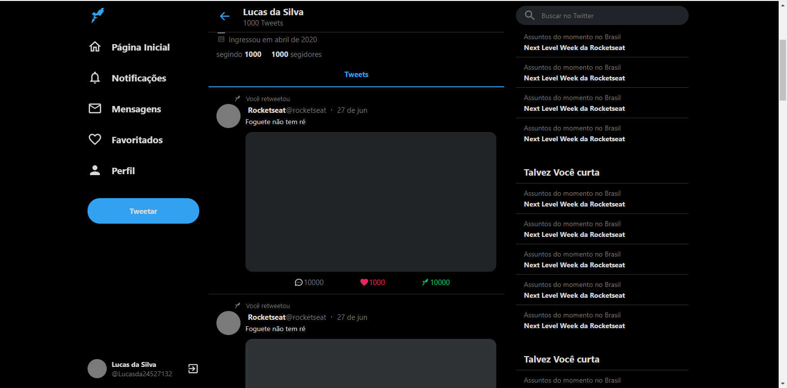

# Copy Twitter front end

Durante meus estudos sobre react uma das atividades foi produzir a interface do Twitter.
Neste projeto, foram utilizados React js, TypeScript, Styled-componets.

## Versão desktop: 

## Versão mobile:

O projeto é totalmente responsivo e tenta respeitar ao máximo o layout do aplicativo original.
Esta atividade utilizou o conceito de Atomic Design, onde divide as funcionalidades dos arquivos.

## Versão desktop 2: 

## Versão mobile 2:

Para iniciar o projeto basta ter em sua maquina o node (versão >= 14.17.0), executar os comandos npm i e npm start.

Obs: Caso gere o seguinte erro: 

     5 |  * LICENSE file in the root directory of this source tree.
     6 |  */
     7 |  * import type { NewPlugin, Options, OptionsReceived } from './types';
       |             ^
     8 |  * export type { Colors, CompareKeys, Config, Options, OptionsReceived, OldPlugin, NewPlugin, Plugin, Plugins, PrettyFormatOptions, Printer, Refs, Theme, } from './types';
     9 |  * export declare const DEFAULT_OPTIONS: Options;
    10 |  * /**

Basta remover a palavra type nas linhas 7 e 8.

